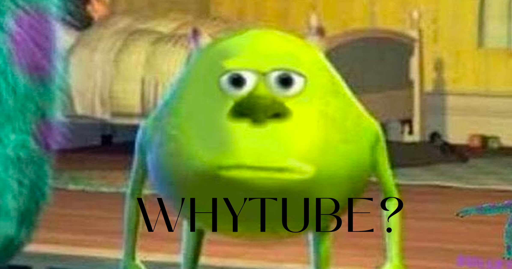

<div align="center">

# WhyTube

##### because why not just keep it. also YouTube sucks.

[](https://www.python.org) [](https://ffmpeg.org) [](https://github.com/astral-sh/uv)
[](https://nodejs.org/) [](https://deno.land/) [](LICENSE)



</div>

---

## ⇁ TOC

- [What Is This](#-what-is-this)
- [Why This Exists](#-why-this-exists)
- [How It Works](#-how-it-works)
- [Requirements](#-requirements)
- [Installation](#-installation)
- [Usage](#-usage)
  - [Single Video](#single-video)
  - [Playlists](#playlists)
  - [Audio Only](#audio-only)
- [Configuration](#-configuration)
  - [All Options](#all-options)
  - [Subtitles](#subtitles)
  - [Thumbnails](#thumbnails)
  - [JS Runtimes](#js-runtimes)
- [Project Structure](#-project-structure)
- [Caveats](#-caveats)

---

## ⇁ What Is This

WhyTube downloads YouTube videos and playlists at the best available quality, without you touching a single format ID or codec setting. Give it a URL, pick a resolution, and it finds the best video stream, grabs the audio separately (yes, YouTube sends them as two separate files like it's 2003), merges them with FFmpeg, embeds the thumbnail, and drops a clean `.mp4` in your Downloads folder.

Does playlists, audio-only rips, and subtitles too. Config reloads between downloads so you can change settings mid-session without restarting like a normal person.

yt-dlp with a brain bolted on top.

---

## ⇁ Why This Exists

YouTube secretly ships video and audio as separate streams. Most download tools pretend this isn't a problem and hand you a muted video, a 360p fallback, or a `.webm` that your media player will open with one eye closed. The ones that actually do it right make you memorize `bestvideo[ext=mp4]+bestaudio[ext=m4a]/best` and type it into a terminal like some kind of codec monk.

Nobody has time for that. Paste a URL, pick a resolution, get a working file.

---

## ⇁ How It Works

WhyTube ranks every available format and picks the best one:

1. **Resolution:** higher wins. 720p is the hard floor so you never accidentally download a potato.
2. **Codec:** `av01 > vp9 > avc1`. Efficiency first, your ancient laptop second.
3. **Container:** `mp4 > webm`. Because you don't want to explain to VLC why it's getting a webm at 11pm.

If the top pick doesn't exist, it moves down the chain. Playlists cap at 1080p by default, because nobody needs a 4K copy of a 10-hour lo-fi stream torching their SSD.

---

## ⇁ Requirements

| Dependency                                                   | Version    | Notes                                                                                                                  |
| ------------------------------------------------------------ | ---------- | ---------------------------------------------------------------------------------------------------------------------- |
| [Python](https://www.python.org/)                            | 3.10+      | Core runtime                                                                                                           |
| [FFmpeg](https://ffmpeg.org/)                                | Any recent | Merges the video and audio streams. Non-negotiable. The script will die without it and it will not be subtle about it. |
| [uv](https://github.com/astral-sh/uv)                        | Any        | Strongly recommended. pip works too if you enjoy suffering.                                                            |
| [Node.js](https://nodejs.org/) or [Deno](https://deno.land/) | Any        | YouTube's bot checks need a JS runtime or they won't let you in.                                                       |

> [!IMPORTANT]
> FFmpeg must be installed and on your system PATH. WhyTube will not run without it, and it will tell you exactly that before exiting.

---

## ⇁ Installation

```bash
git clone https://github.com/nyniraula/Whytube.git
cd Whytube
uv sync
```

Prefer pip for some reason:

```bash
pip install yt-dlp[default]
```

---

## ⇁ Usage

```bash
uv run main.py
```

WhyTube detects your Node.js or Deno installation at startup. No path config needed unless you installed it somewhere weird.

### Single Video

1. Paste the URL when prompted
2. Pick a resolution (720p minimum, we have standards)
3. File saves to `~/Downloads/WT_Downloads/`

### Playlists

Paste a playlist URL and WhyTube runs through the whole thing on autopilot. Capped at 1080p by default so you don't accidentally download an entire channel in 4K and have to explain that to your hard drive.

### Audio Only

Set `download_type` to `"audio"` in `config.json` to rip straight to `.m4a`. For playlists, use `playlist_download_type`.

```json
"download_type": "audio"
"playlist_download_type":"audio"
```

---

## ⇁ Configuration

Edit `config.json` in the project root. Changes apply on the next download loop so you can mess with settings mid-session and they'll kick in immediately. No ritual restarts.

### All Options

```json
{
  "no_warnings": true,
  "quiet": true,
  "merge_output_format": "mp4",
  "outtmpl": "%(title)s - %(uploader)s.%(ext)s",
  "download_type": "video",
  "writesubtitles": false,
  "writeautomaticsub": true,
  "subtitleslangs": ["en"],
  "subtitlesformat": "srt/ass/vtt",
  "playlist_download_type": "video",
  "playlist_download_cap": "1080",
  "postprocessor_args": {
    "ffmpeg": ["-c:a", "aac"]
  },
  "writethumbnail": true,
  "embedthumbnail": true,
  "postprocessors": [{ "key": "EmbedThumbnail" }],
  "js_runtimes": {
    "deno": { "path": null },
    "node": { "path": null }
  }
}
```

| Key                      | Type   | Default                              | Description                                                                                          |
| ------------------------ | ------ | ------------------------------------ | ---------------------------------------------------------------------------------------------------- |
| `no_warnings`            | bool   | `true`                               | Suppress yt-dlp warnings                                                                             |
| `quiet`                  | bool   | `true`                               | Suppress yt-dlp output noise                                                                         |
| `merge_output_format`    | string | `"mp4"`                              | Container format after merge                                                                         |
| `outtmpl`                | string | `"%(title)s - %(uploader)s.%(ext)s"` | Filename template. Output always goes to `~/Downloads/WT_Downloads/` regardless of what you put here |
| `download_type`          | string | `"video"`                            | `"video"` or `"audio"` for single URL downloads                                                      |
| `writesubtitles`         | bool   | `false`                              | Download manually uploaded subtitles                                                                 |
| `writeautomaticsub`      | bool   | `true`                               | Download auto-generated subtitles                                                                    |
| `subtitleslangs`         | array  | `["en"]`                             | Subtitle language codes                                                                              |
| `subtitlesformat`        | string | `"srt/ass/vtt"`                      | Preferred subtitle format, in priority order                                                         |
| `playlist_download_type` | string | `"video"`                            | `"video"` or `"audio"` for playlist downloads                                                        |
| `playlist_download_cap`  | string | `"1080"`                             | Max resolution for playlists. Raise at your own storage's expense.                                   |
| `writethumbnail`         | bool   | `true`                               | Download thumbnail                                                                                   |
| `embedthumbnail`         | bool   | `true`                               | Embed thumbnail into the output file                                                                 |
| `postprocessors`         | array  | `[{"key": "EmbedThumbnail"}]`        | yt-dlp post-processing steps                                                                         |

### Subtitles

```json
"writeautomaticsub": true,   // auto-generated captions
"writesubtitles": false,     // manually uploaded subs
"subtitleslangs": ["en"],    // list of language codes
"subtitlesformat": "srt/ass/vtt"
```

To turn off subtitles entirely, set both write flags to `false`. Nobody's judging.

### Thumbnails

Thumbnails get embedded into the `.mp4` and the loose image file is deleted afterward so it doesn't just sit there staring at you.

To turn off:

```json
"writethumbnail": false,
"embedthumbnail": false,
"postprocessors": []
```

### JS Runtimes

```json
"js_runtimes": {
  "deno": { "path": null },
  "node": { "path": null }
}
```

Both start as `null` and get filled in at startup. Only touch this if your runtime is installed somewhere exotic that isn't on PATH.

---

## ⇁ Project Structure

```
Whytube/
├── main.py                 # Entry point and main download loop
├── config.json             # Your config lives here
├── utils/
│   ├── source_handler.py   # Loads config, preps download directory
│   ├── URLresolver.py      # Validates URLs, fetches media info
│   ├── MediaPipeline.py    # Routes to video, audio, or playlist logic
│   ├── downloader.py       # Wraps yt-dlp, fires off the download
│   ├── format_ranking.py   # Ranks formats by codec + container preference
│   ├── format_resolver.py  # Cleans up ranked formats, enforces 720p floor
│   ├── dependencies.py     # Detects FFmpeg and JS runtimes
│   ├── cleanup.py          # Deletes leftover thumbnail files post-run
│   └── terminal.py         # Cross-platform terminal clear
└── assets/
    └── whytube_banner.png
```

---

## ⇁ Caveats

- YouTube sends video and audio as separate streams, so WhyTube downloads both and merges them. This is not a bug. This is just how YouTube works and they never told anyone.
- Audio is always re-encoded to AAC. Widest compatibility, zero drama.
- FFmpeg is non-negotiable. The script will tell you loudly and exit if it can't find it.
- Same goes for a JS runtime. YouTube's bot detection blocks you without one. Node.js or Deno, either works.
- `outtmpl` controls the filename only. Files always go to `~/Downloads/WT_Downloads/` and that's not up for debate.
- `config.json` reloads every loop. Change something mid-session and it applies on the next download.

---

<div align="center">

**[Issues](https://github.com/nyniraula/Whytube/issues)** · **[Pull Requests](https://github.com/nyniraula/Whytube/pulls)** · **[MIT License](LICENSE)**

</div>
